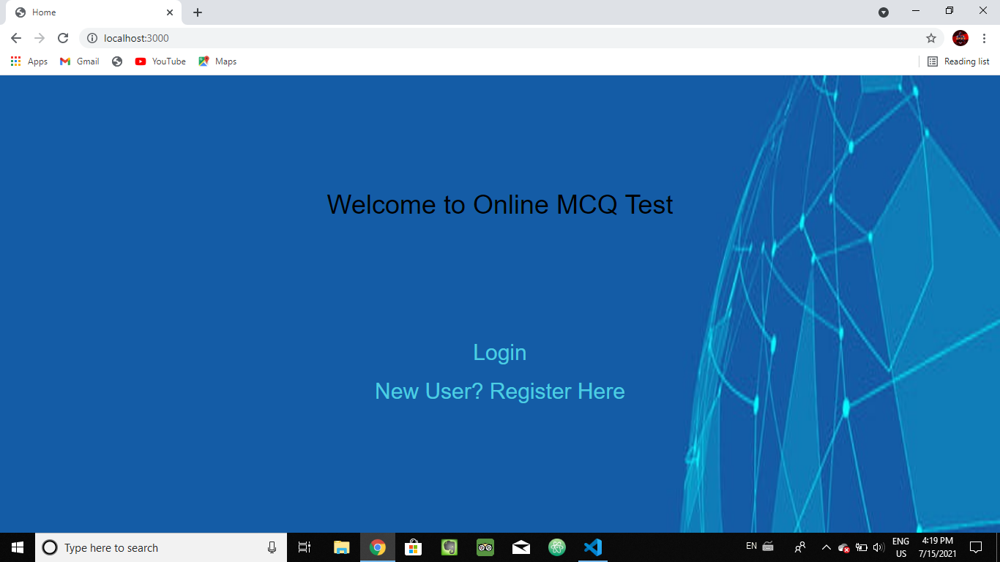
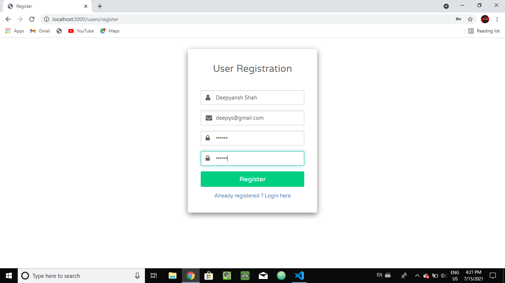
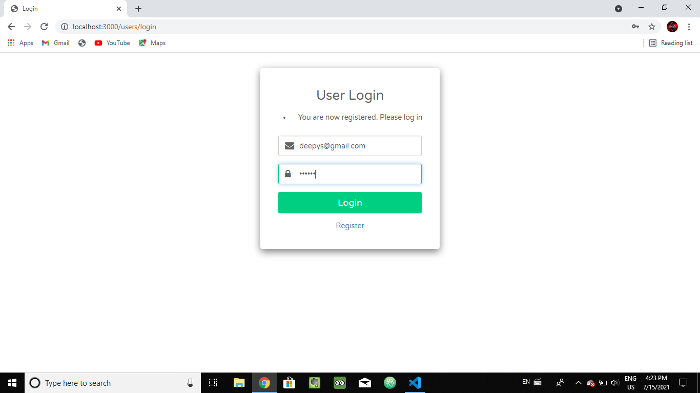
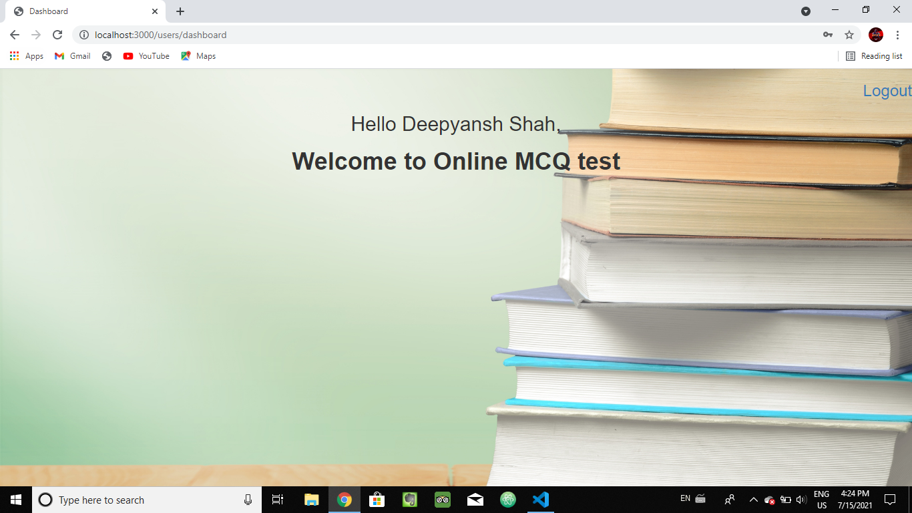

# Problem Statement:
# Create a User Session Management for the test platform.

IDE used:Visual Studio Code. 

Programming languages used:HTML,CSS,BOOTSTRAP,JAVASCRIPT. 

Dependancies used:Dotenv,Bcrypt,express-session,express-flash,passport,passport-local,pg,ejs.

devDependancies used:nodemon

Database:PostgreSQL.

# Contributions:

@Varun1619 varun1619singh@gmail.com

* Done some research about the topic 
* Created frontend.

@Vidhati2 vidhati0@gmail.com

* Done some research about the topic
* Helped @Varun1619 in making frontend(dashboard)

@Riddhi-shetty smvrshetty5@gmail.com

* Done some research about the topic
* Helped @Varun1619 in making frontend(register,login)
* Completed the backend part for the user authentication

@Poorvasawant17 poorvasawant2000@gmail.com

* Done some research about the topic 
* Helped @Varun1619 in making frontend(index)

@Manasa2001 Manasanagilla321@gmail.com

* Done some research about the topic
* Helped @yash100799 and @yashmpandit in connecting Frontend and Backend with database

@Hroy08 royhritik2208@gmail.com

* Done some research about the postgreSQL database
* Created database for the project 
* Helped @kdarji25 to make the report for project

@kdarji25 kdarji2000@gmail.com

* Done some research about the postgreSQL database
* Helped @Hroy08 in making Database
* Making the report for the given project

@sagarteli sagarteli@hotmail.com

* Done some research about the postgreSQL database
* Helped @Hroy08 in making database

@Pankajverma786 pv310473@gmail.com

* Done some research about the postgreSQL database
* Helped @Hroy08 in making database

@yash100799 sat107kar@gmail.com

* Done some research about the project
* Research about the libraries to use for the project 
* Helped @Riddhi-shetty to create the backend
* Connected it to the database

@yashmpandit yashmpandit@gmail.com

* Done some research about the project
* Helped @yash100799 in making of backend

@DeepyanshShah deepyanshshah11@gmail.com

* Done some research for the project
* Helped @yash100799 in making backend
* Helped @Manasa2001 for Connecting it with the database

@KrutikaNikalje01 krutikanikalje01@gmail.com

* Done some research about the project 
* Helped @yash100799 in making of backend

@Reshma62000 reshmakhare76@gmail.com
* Gathering information releated to session management
* Helped @yash100799 in creating backend for session

# Screenshots:

* Folder Structure

* HomePage

* UserRegistration

* UserLogin

* DashBoard

* Register Activity in Backend

* Login Activity in Backend

* PostgreSQL Database

